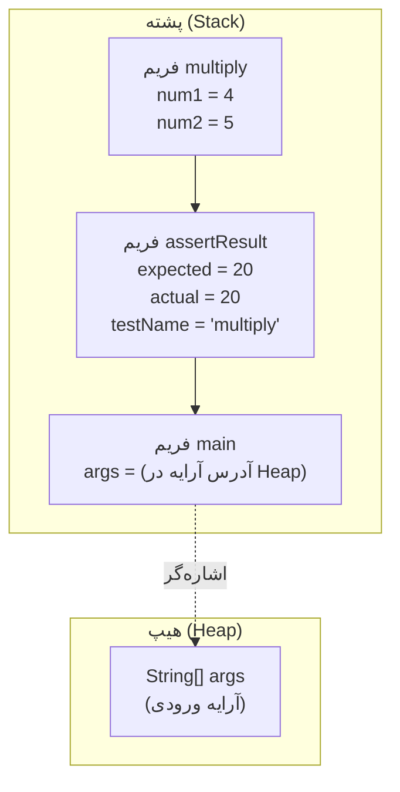

# پروژه کارگاه برنامه‌سازی پیشرفته - تمرین دیباگ

## نمودار حافظه (Heap & Stack)

```mermaid
graph TB
    subgraph Stack["پشته (Stack)"]
        direction TB
        Frame3["فریم multiply<br>num1 = 4<br>num2 = 5"]
        Frame2["فریم assertResult<br>expected = 20<br>actual = 20<br>testName = 'multiply'"]
        Frame1["فریم main<br>args = (آدرس آرایه در Heap)"]
        
        Frame3 --> Frame2
        Frame2 --> Frame1
    end

    subgraph Heap["هیپ (Heap)"]
        Arr["String[] args<br>(آرایه ورودی)"]
    end

    Frame1 -.->|اشاره‌گر| Arr
```
