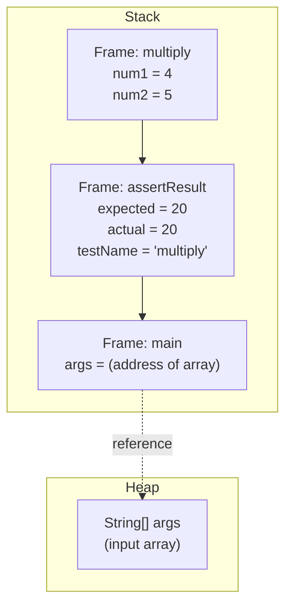

# AP Workshop 5 - Debugging Exercise

## Heap & Stack Memory Diagram

During the execution of `AUTMath.multiply(4, 5)`, the memory state is as follows:



### Explanation:

- **Primitive types (`int`)** are stored directly in the **Stack**.
- Each method call creates a new **Stack Frame**.
- The **Heap** only contains the `String[] args` array (managed by JVM).
- No custom objects are created in this program.

---

## Bugs Fixed

1. **`multiply` bug**: Was using addition (`+`), fixed to multiplication (`*`).
2. **`divide` bug**: Was using multiplication (`*`), fixed to division (`/`).
3. **`pow` function**: Was incomplete, now implemented correctly.

### Final Output After Fixes:

```text
sum passed!
subtract passed!
multiply passed!
divide passed!
factorial passed!
pow passed!
```
